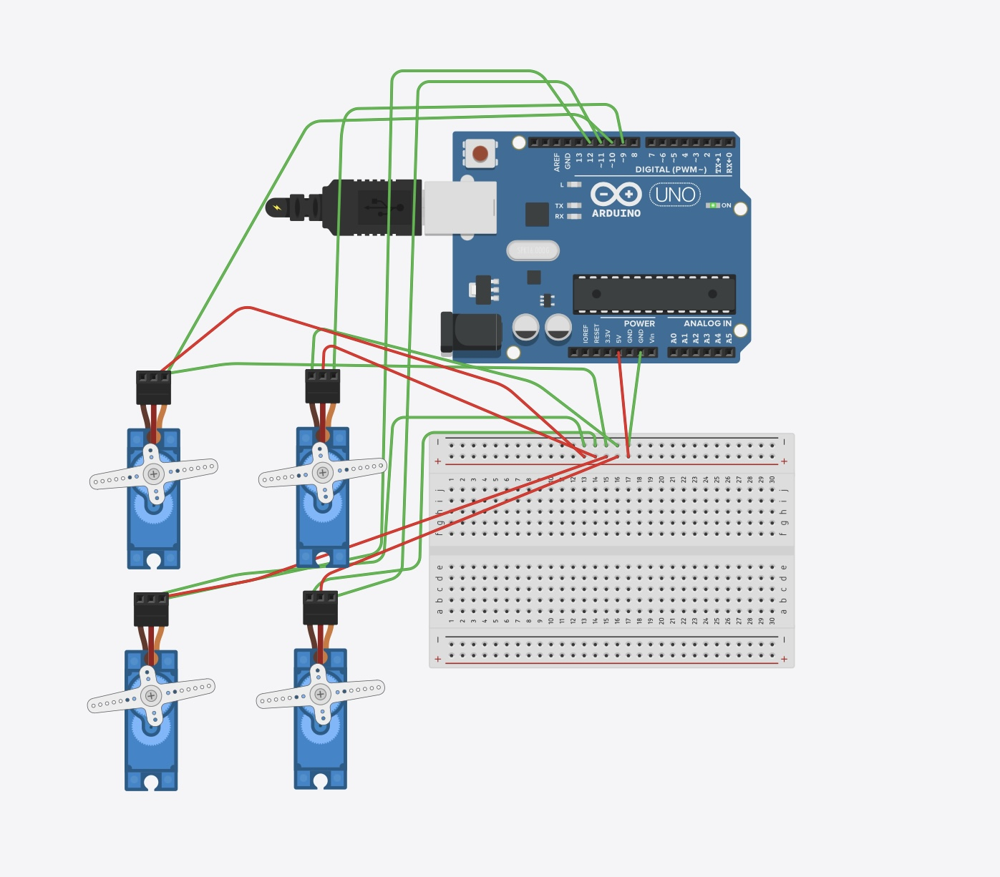

# Arduino - 4 Servo Motors Control

This project demonstrates how to control 4 servo motors using an Arduino UNO.  
The servos sweep for 2 seconds, then hold position at 90°.

## 🔧 Components

- Arduino UNO
- 4 × Servo Motor
- Breadboard
- Jumper Wires
- (Optional) 6V battery pack or 5V adapter for external power

## ⚡ Wiring

| Servo | Signal Pin | Power (5V) | GND |
|-------|------------|------------|-----|
| 1     | D9         | Breadboard + | Breadboard – |
| 2     | D10        | Breadboard + | Breadboard – |
| 3     | D11        | Breadboard + | Breadboard – |
| 4     | D12        | Breadboard + | Breadboard – |

> Connect Arduino 5V and GND to the breadboard’s + and – rails  
> OR use an external power source (e.g., 6V battery) and connect its GND to Arduino GND

## 🎯 Behavior

- All servos sweep from 0° to 180° for 2 seconds.
- After that, they stop at 90°.

## 🖼️ Circuit Illustration

## ⚠️ Notes

- The Arduino UNO can’t always power 4 servos directly. Use external power if needed.
- Always connect GND of external power source with Arduino GND.
